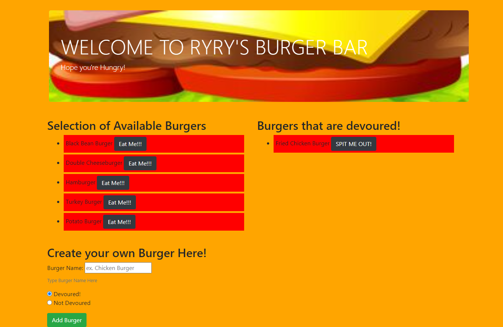

# homework_13_node_express_handlebars_hamburger

## Description

In this assignment, you'll create a burger logger with MySQL, Node, Express, Handlebars and a homemade ORM (yum!). Be sure to follow the MVC design pattern; use Node and MySQL to query and route data in your app, and Handlebars to generate your HTML.

You can add a burger, devoure a burger, or spit out a burger

## Installation

To use application simpily click on Heroku Link below

## Usage

Not Applicable 

## Technologies Used

NPM - Inquirer Package, MySql, JavaScript, PicResize, Heroku, Bootstrap

## Problems I faced

This was a very difficult assignment 

## Credits

Ryan Witherspoon

## Image

## Links
[link to GitHub!](https://github.com/ryanwit/homework_13_node_express_handlebars_hamburger)

[link to Heroku!](https://github.com/ryanwit/homework_10_team_profile_generator)

[link to Screencastify Demo!](https://drive.google.com/file/d/1rrUyZWQYi47d-9Ed4cdVNochJUtbFbze/view)

# License
